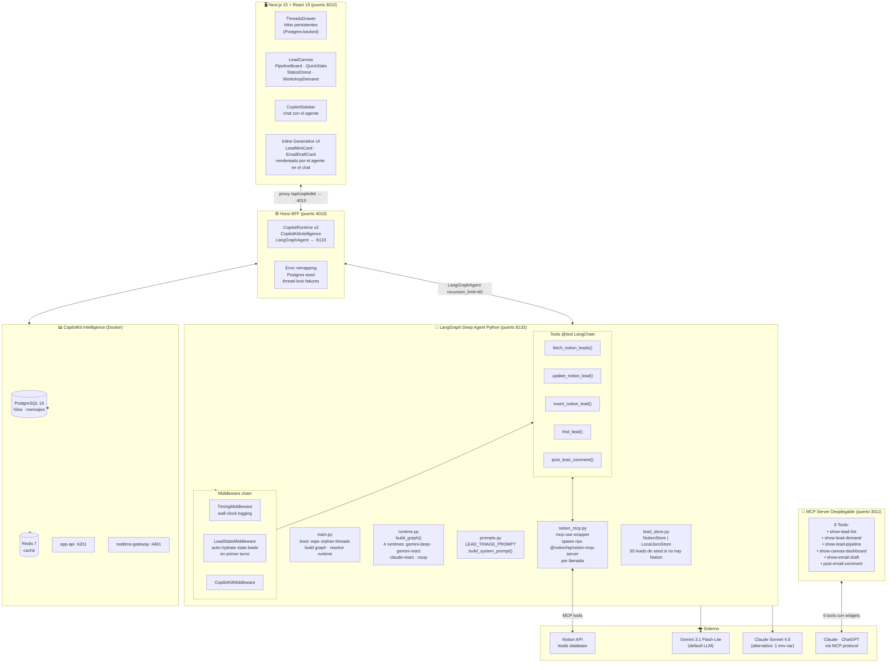
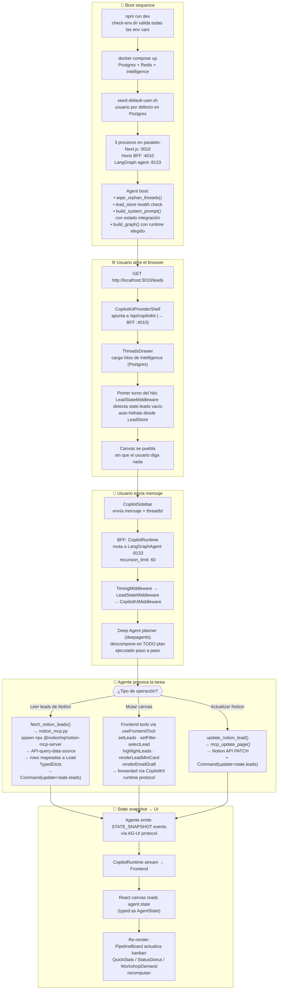
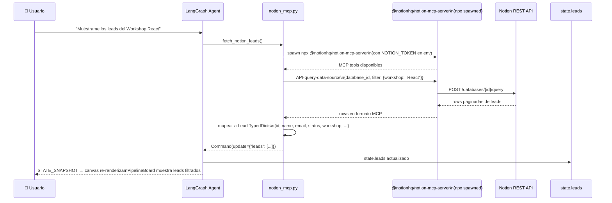
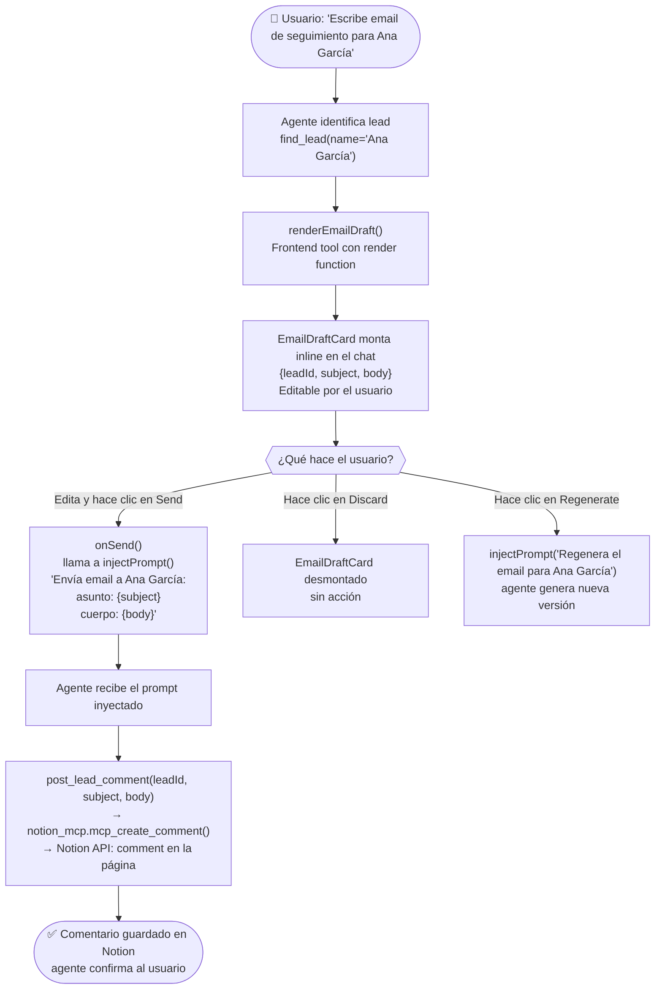
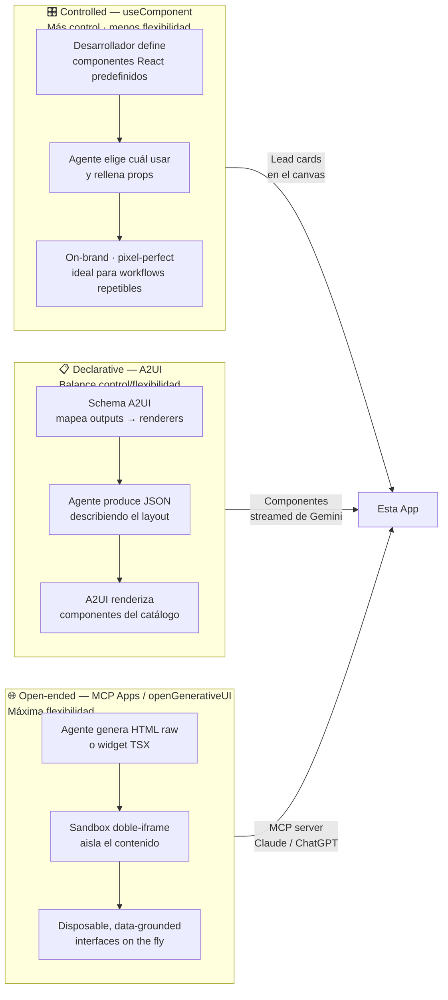
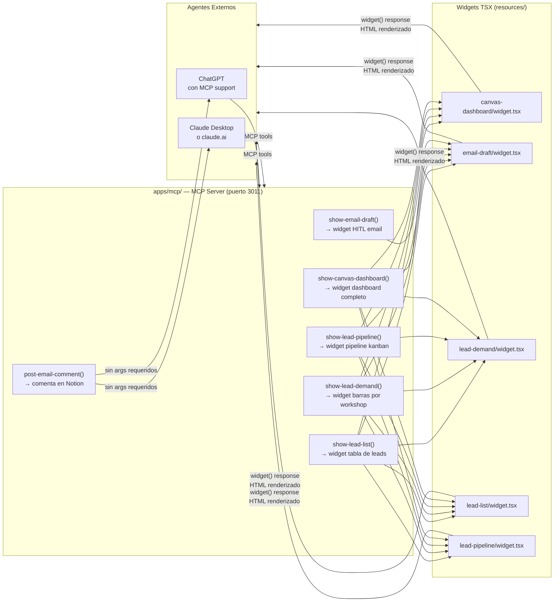

# Generative UI Global Hackathon — Agentic Interfaces Starter Kit

> **Starter kit completo para construir interfaces agénticas con UI generativa.**

Una aplicación full-stack funcional que combina un agente LangGraph, un canvas kanban de leads sincronizado por IA, hilos de conversación persistentes (Postgres), integración real con Notion vía MCP, y un servidor MCP desplegable que corre nativo en Claude y ChatGPT.

**Stack:** Next.js 15 · LangChain Deep Agents · CopilotKit · Gemini · Notion MCP · Manufact

---

## Tabla de Contenidos

1. [Arquitectura General](#arquitectura-general)
2. [Flujo de Información — Pipeline Completo](#flujo-de-información--pipeline-completo)
3. [Flujo de Sincronización con Notion](#flujo-de-sincronización-con-notion)
4. [Flujo HITL — Email Draft con Human-in-the-Loop](#flujo-hitl--email-draft)
5. [Generative UI — 3 Paradigmas](#generative-ui--3-paradigmas)
6. [MCP Server Desplegable](#mcp-server-desplegable)
7. [Stack Técnico](#stack-técnico)
8. [Estructura del Proyecto](#estructura-del-proyecto)
9. [Instalación y Setup](#instalación-y-setup)
10. [Puertos de Referencia](#puertos-de-referencia)

---

## Arquitectura General



---

## Flujo de Información — Pipeline Completo

Cómo viaja la información desde que el usuario abre el browser hasta que el canvas se actualiza.



---

## Flujo de Sincronización con Notion

El agente usa `mcp-use` para comunicarse con Notion sin importar el driver directamente.



---

## Flujo HITL — Email Draft

El Human-in-the-Loop del email draft usa un frontend tool con render inline en el chat.



---

## Generative UI — 3 Paradigmas



---

## MCP Server Desplegable



---

## Stack Técnico

| Capa | Tecnología | Detalle |
|---|---|---|
| Frontend | Next.js 15 + React 19 + TypeScript | Tailwind CSS v4 · Radix UI · dnd-kit · Recharts |
| CopilotKit | `@copilotkit/react-core` v2 | CopilotSidebar · useFrontendTool · useAgent · A2UI |
| BFF | Hono (Node.js) + TypeScript | CopilotRuntime v2 + CopilotKitIntelligence + LangGraphAgent |
| Agent | Python 3.11+ + LangGraph | deepagents (default) · react-agent (alternativo) |
| LLM default | Gemini 3.1 Flash-Lite | `langchain-google-genai` |
| LLM alternativo | Claude Sonnet 4.6 | 1 env-var swap: `AGENT_RUNTIME=claude-sonnet-4-6-react` |
| Notion | `@notionhq/notion-mcp-server` vía `mcp-use` | spawned como subproceso npx |
| Intelligence | CopilotKit composite container | Postgres 16 · Redis 7 · threads persistentes |
| MCP server | `mcp-use/server` TypeScript | 6 tools · deployable a Manufact Cloud |
| Package mgmt | npm workspaces (frontend/bff/mcp) + uv (Python) | — |

---

## Estructura del Proyecto

```
Generative-UI-Global-Hackathon-Starter-Kit/
├── package.json                    # Root npm workspace
├── .env.example
├── scripts/
│   ├── check-env.sh                # Pre-flight: valida env vars
│   └── seed-default-user.sh        # Crea usuario por defecto en Postgres
├── deployment/
│   ├── docker-compose.yml          # Postgres + Redis + Intelligence
│   └── init-db/01-create-databases.sql
├── data/
│   └── notion-leads-sample/        # CSV + ZIP de leads de ejemplo
├── dev-docs/
│   ├── architecture.md             # Diagramas de arquitectura
│   ├── setup.md · model-switching.md · mcp-server.md
│   └── threads.md · customization.md · demo-prompts.md
│
└── apps/
    ├── frontend/                   # Next.js 15 — puerto 3010
    │   ├── next.config.ts          # Rewrites /api/copilotkit/* → BFF :4010
    │   └── src/
    │       ├── app/leads/page.tsx  # Página principal: canvas + chat + tools
    │       ├── components/
    │       │   ├── copilot/        # CopilotKitProviderShell · ToolFallbackCard
    │       │   ├── leads/          # PipelineBoard · LeadCard · QuickStats
    │       │   │                   # StatusDonut · WorkshopDemand
    │       │   ├── leads/inline/   # LeadMiniCard · EmailDraftCard (HITL)
    │       │   └── threads-drawer/ # Sidebar de hilos persistentes
    │       └── lib/leads/
    │           ├── types.ts        # Lead · AgentState · LeadFilter
    │           ├── optimistic.ts   # applyPatch / revertPatch
    │           └── derive.ts       # applyFilter · topWorkshop
    │
    ├── bff/                        # Hono BFF — puerto 4010
    │   └── src/server.ts           # CopilotRuntime v2 + LangGraphAgent
    │
    ├── agent/                      # Python LangGraph — puerto 8133
    │   ├── main.py                 # Entry point: build_graph · boot checks
    │   └── src/
    │       ├── runtime.py          # build_graph(): 4 runtimes
    │       ├── prompts.py          # Prompts del agente + integration status
    │       ├── lead_state.py       # LeadStateMiddleware: auto-hydrate
    │       ├── lead_store.py       # NotionStore | LocalJsonStore
    │       ├── notion_mcp.py       # mcp-use facade
    │       ├── notion_tools.py     # @tool definitions
    │       └── canvas.py           # Stubs del contrato de frontend tools
    │
    └── mcp/                        # MCP Server desplegable — puerto 3011
        ├── index.ts                # 6 tools con widget responses
        └── resources/              # Widget TSX por tool
```

---

## Instalación y Setup

### Prerrequisitos

- Node.js 18+ · npm · Python 3.11+ · uv (Python package manager) · Docker Desktop

### 1. Variables de entorno

```bash
cp .env.example .env
```

Variables mínimas requeridas:

| Variable | Descripción |
|---|---|
| `GOOGLE_API_KEY` | API key de Google Gemini (LLM default) |
| `ANTHROPIC_API_KEY` | API key de Anthropic Claude (opcional — si usas runtime claude) |
| `COPILOTKIT_CLOUD_PUBLIC_API_KEY` | API key de CopilotKit Intelligence |
| `NOTION_TOKEN` | Token de integración de Notion (opcional) |
| `NOTION_DATABASE_ID` | ID de la database de leads en Notion (opcional) |

### 2. Iniciar infraestructura

```bash
# Postgres + Redis + CopilotKit Intelligence
docker compose -f deployment/docker-compose.yml up -d

# Crear usuario por defecto
bash scripts/seed-default-user.sh
```

### 3. Instalar dependencias

```bash
# Frontend + BFF + MCP (npm workspaces)
npm install

# Agent (Python)
cd apps/agent
uv sync
```

### 4. Levantar los servicios

```bash
# Todo en paralelo (recomendado)
npm run dev

# O por separado:
npm run dev --workspace=apps/frontend   # :3010
npm run dev --workspace=apps/bff         # :4010
cd apps/agent && langgraph dev --port 8133
```

### 5. (Opcional) Levantar MCP Server

```bash
npm run dev --workspace=apps/mcp        # :3011
```

**Acceder a la app:** http://localhost:3010

---

## Puertos de Referencia

| Servicio | Puerto |
|---|---|
| Next.js frontend | 3010 |
| Hono BFF | 4010 |
| LangGraph agent | 8133 |
| MCP server (Manufact) | 3011 |
| Intelligence app-api | 4201 |
| Intelligence realtime-gateway | 4401 |
| PostgreSQL | 5436 (default) |
| Redis | 6382 (default) |

---

## Customización Rápida

| Quiero... | Archivo a editar |
|---|---|
| Cambiar el LLM | `.env` → `AGENT_RUNTIME=claude-sonnet-4-6-react` |
| Agregar un frontend tool | `apps/frontend/src/app/leads/page.tsx` → `useFrontendTool()` |
| Cambiar fuente de datos | `apps/agent/src/lead_store.py` → implementar `LeadStore` protocol |
| Agregar tool al agente | `apps/agent/src/notion_tools.py` → `@tool` decorator |
| Agregar tool al MCP server | `apps/mcp/index.ts` → nuevo `server.tool()` + widget en `resources/` |
| Personalizar el prompt | `apps/agent/src/prompts.py` → `LEAD_TRIAGE_PROMPT` |

---

## Fork vs. Upstream

Este fork es de `jerelvelarde/Generative-UI-Global-Hackathon-Starter-Kit` creado el 09/05/2026.

La app de ejemplo gestiona leads de un workshop usando Notion como backend y demuestra los 3 paradigmas de Generative UI. Para adaptarla a tu caso de uso, reemplaza la capa de Notion por cualquier otra fuente de datos vía MCP, y los componentes `Lead*` por tus propias entidades.

---

*Generative UI Global Hackathon: Agentic Interfaces · CopilotKit · 2026*
